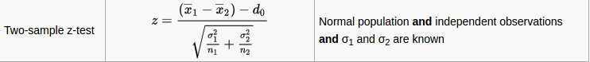

<h3>Project 2 Data Collection.</h3>

I have scraped together two datasets: <ul>
<li><a href="https://github.com/ekivolowitz/p2/blob/master/baseball_birthdays.txt">baseball_birthdays.txt</a> 1935 players.</li>
<li><a href="https://github.com/ekivolowitz/p2/blob/master/football_birthdays.txt">football_birthdays.txt</a> 4104 players.</li>
</ul>
Each of these files contain the birthday information on the entire population of athletes in the respective sports in no particular order.

<h3>Moving Forward</h3>
Either we take random samples from both populations and compare them individually, or we use both of the entire populations as our samples.
For the populations as samples, we could use a Two-Sample Z-Test.

We can do this because both Standard Deviations for both populations are known (more rather we can relatively easily determine them by analyzing the data).

